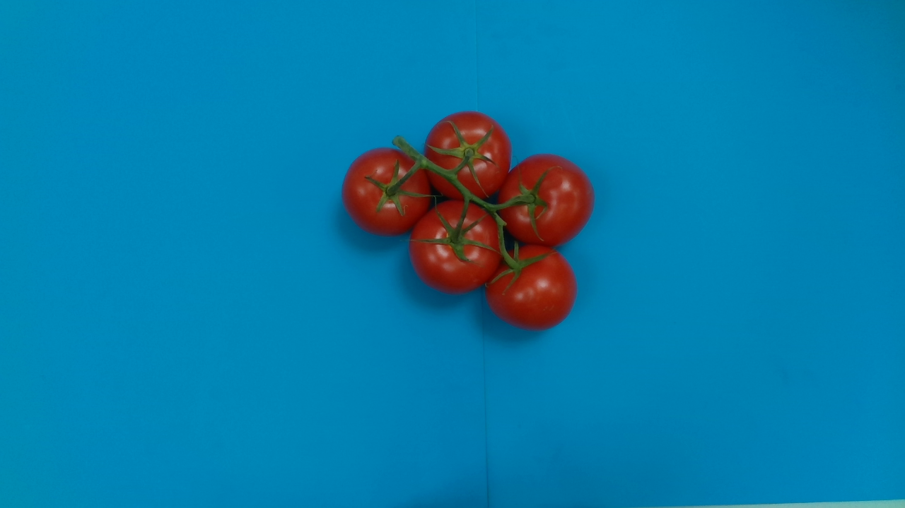
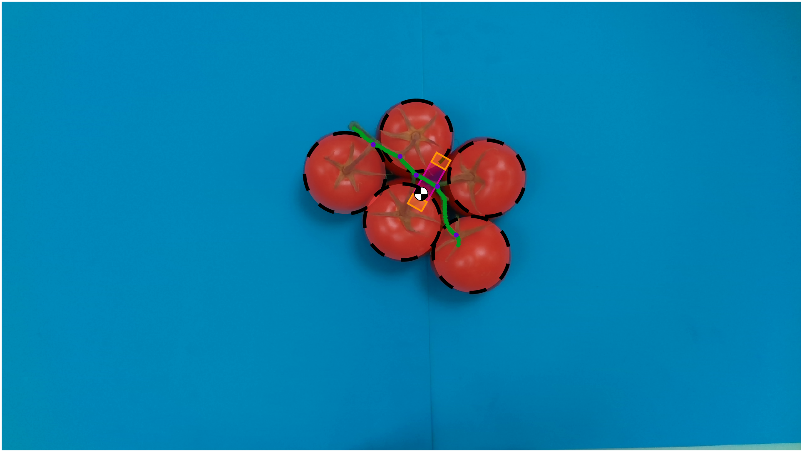
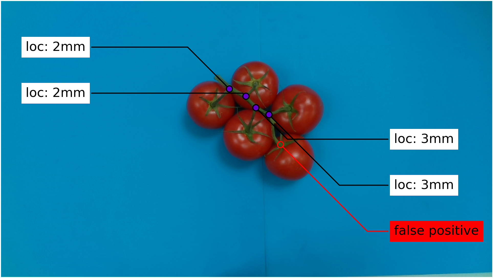
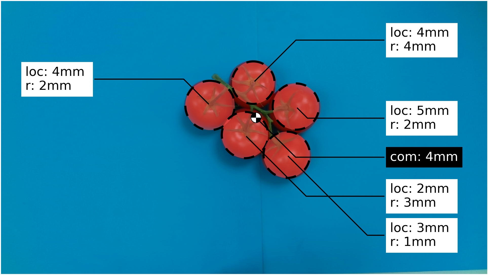

# Detect truss 

A python package to extract truss features from a given image and determined an optimal grasping pose.

## 1 Installation
> :warning: This package uses python 2!

Install the dependencies with the requirements.txt file from the current directory:
```
python2 -m pip install -r requirements.txt
```

### 1.3 Verify Instalation
Run the tests from this directory:
```
python2 -m unittest discover test
```

## 2 Genral introduction
A suitable grasp location can be determined based on detected featured:

<p float="center">
  
  
</p>

Moreover, if you provide a ground truth, the predicted feature errors may be determined:

<p float="center">
  
  
</p>

These tasks can be executed as follows:
1. The main file for feature extraction and grasp pose estimation is [process_image.py](scripts/process_image.py)
2. The main file for comparing these results with the ground truth is [analyze_results.py](src/flex_vision/detect_truss/analyze_results.py)


## conventions
All image coordinates are stated as (x,y) as this is also the default for openCV and matplotlib. This means that for numpy these coordinates need to be swapped to get (row, column). 


## Data

### Process image
ProcessImage requires the following data per image:

1. An rgb image called [id].png
2. A [id]_info.json file containing the field px_per_mm which describes the number of pixels per millimeter present at the truss level

Contact me if you are interested in the data set I used.

### Analyze results
ProcessImage will generate a prediction file .json file called [id].json, in the results/dataset/json folder. This file contains information about the predicted tomatoes, peduncle and grasp locations. To analyze the results the following data is required:

1. A ground truth [id].json file containing the actual features
2. A prediction [id].json file containing the predicted predicted features


## Issues
# cv2 setup
Python 2.7 is not supported anymore in opencv-python-4.3.0.38 the support was dropped since 4.3.0.36, see [this](https://github.com/opencv/opencv-python/issues/371#issuecomment-671292850) issue. Hance the latest openCV version supporting python 2.7 should be installed:

```
pip2 install opencv-python==4.2.0.32
```

